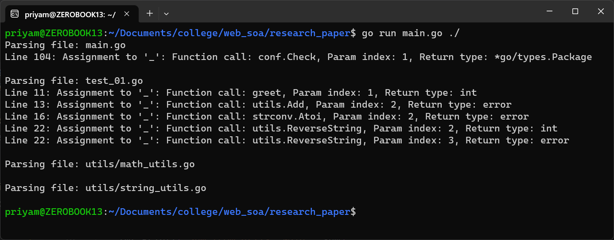

# AST Improved Unhandled Errors

This repository presents an improvement to the vulnerability detection framework for Hyperledger Fabric smart contracts, as described in the research paper titled **"A Vulnerability Detection Framework for Hyperledger Fabric Smart Contracts Based on Dynamic and Static Analysis"**. The original approach in the paper identifies unhandled errors by simply declaring every variable whose name is `_`. This repository suggests an enhanced approach that not only considers the variable name but also identifies the variable type by referring to the function definition and its return type.

## Table of Contents

- Introduction
- Improvement Overview
- Repository Structure
- How to Run
- Requirements
- Output
- References
- Contributors

## Introduction

The research paper introduces a framework for detecting vulnerabilities in Hyperledger Fabric smart contracts using both dynamic and static analysis techniques. One of the key challenges addressed in the paper is the identification of unhandled errors. The original approach in the paper is simplistic, declaring every variable named `_` as an unhandled error. This repository proposes a more sophisticated method that leverages the Abstract Syntax Tree (AST) to identify the type of variables, thereby improving the accuracy of error detection.

## Improvement Overview

The proposed improvement involves the following steps:

1. **AST Parsing**: The code is parsed to generate an Abstract Syntax Tree (AST).
2. **Variable Identification**: Variables are identified by their names and types.
3. **Function Analysis**: The function definitions and their return types are analyzed to determine the type of variables.
4. **Error Detection**: Unhandled errors are detected based on the variable type and context.

This approach ensures that only relevant variables are flagged as unhandled errors, reducing false positives.

## Repository Structure

```bash
  AST_improved_unhandled_errors/
  ├── main.go            # improved code
  ├── README.md
  ├── go.mod
  ├── go.sum
  └── docs/
  └── project code
```

- **main.go**: The main file containing the AST-based code for improved unhandled error detection.
- **project code**: The project you want to test for vulnerabilities.

## How to Run

To run the code, follow these steps:

1. **Clone the Repository**:

   ```bash
   git clone https://github.com/p-y-t/AST_improved_unhandled_errors.git
   cd AST_improved_unhandled_errors
   ```

2. **Ensure Dependencies**:

- Make sure all module requirements are fulfilled for the code you want to run the test on.

3. **Run the Code**:

```bash
  go run main.go ./
```

## Requirements

- **Go Version**: 1.23.3 or higher.
- **Module Requirements**: Ensure all dependencies for the code you want to test are installed.

## Output

The output of the code will be a list of unhandled errors detected using the improved approach. A screenshot of the output is provided in the `screenshots/` directory for reference.



## References

- **Original Approach Code**: [HFCCT Repository](https://github.com/PerryLee69/HFCCT)

## Contributors

- **Priyamkumar Trambadia**
